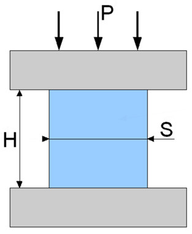

### Introduction

Many structural and machine components are subjected to compressive loads during service. Columns in buildings, bridge piers, machine supports, concrete blocks, and masonry structures are common examples of members that primarily resist compression.

A compression test is performed to determine the behaviour of a material when subjected to gradually increasing compressive loads. The test provides information about the material's resistance to crushing, shortening, and deformation under compression.

The experiment is commonly carried out using a Universal Testing Machine (UTM), where a specimen is compressed between two rigid platens until significant deformation or failure occurs.

### Physical Concept

When a compressive force acts on a material, internal resisting forces are developed within the specimen. These forces oppose the applied load and produce compressive stress.

As the load increases, the specimen shortens in the direction of loading and expands laterally. The amount of shortening depends on the material properties, specimen dimensions, and magnitude of the applied load.

<b>Figure 1. Compression Test Specimen Subjected to Axial Compressive Load</b>

_A cylindrical specimen is placed between the compression platens of a testing machine and subjected to an axial compressive load P. The applied load reduces the specimen height H and causes lateral expansion represented by S. The resulting deformation is used to determine the compressive properties of the material._

### Everyday Intuition

Compression is commonly observed in everyday life.

Examples include:

- Building columns supporting roof loads.
- Concrete blocks carrying structural loads.
- Bridge piers supporting decks and traffic loads.
- Foundations transmitting loads to the ground.

In each case, the material must safely withstand compressive forces without excessive deformation or failure.

### Experimental Relevance

The compression test is used to evaluate the performance of materials subjected to compressive loading.

The test helps determine:

- Compressive stress
- Compressive strain
- Elastic limit
- Yield strength
- Compressive strength
- Deformation characteristics

These properties are important in the design of columns, foundations, concrete structures, machine components, and load-bearing elements.

### Apparatus and Working Principle

The experiment is performed using a Universal Testing Machine (UTM).

The major components include:

- Loading frame
- Compression platens
- Load measuring system
- Dial gauge or displacement measuring device
- Control panel

The specimen is placed between the compression platens of the machine. A gradually increasing compressive load is applied while the corresponding deformation is measured. The collected observations are used to evaluate the compressive behaviour of the material.

### Mathematical Formulation

#### Compressive Stress

Compressive stress is the applied load divided by the original cross-sectional area.

$$
\sigma_c=\frac{P}{A}
$$

where:

- $\sigma_c$ = Compressive stress (N/mm² or MPa)
- $P$ = Applied compressive load (N)
- $A$ = Original cross-sectional area (mm²)

#### Compressive Strain

Compressive strain is the ratio of change in length to the original length.

$$
\epsilon_c=\frac{\Delta L}{L}
$$

where:

- $\epsilon_c$ = Compressive strain
- $\Delta L$ = Reduction in length
- $L$ = Original specimen length

#### Young's Modulus

Within the elastic region, stress is proportional to strain.

$$
E=\frac{\sigma_c}{\epsilon_c}
$$

where:

- $E$ = Young's Modulus

### Behaviour of Materials in Compression

#### Ductile Materials

Examples:

- Mild Steel
- Aluminium
- Copper

Characteristics:

- Undergo large plastic deformation before failure.
- Usually deform by bulging or barreling.
- Failure may not occur even at large compressive strains.

#### Brittle Materials

Examples:

- Cast Iron
- Concrete
- Stone

Characteristics:

- Exhibit comparatively small deformation.
- Fail suddenly by cracking or crushing.
- Possess high compressive strength compared to tensile strength.

### Engineering Significance

Compression testing plays an important role in civil, mechanical, and structural engineering.

The results help engineers:

- Select suitable materials for compression members.
- Design safe columns and foundations.
- Evaluate concrete and masonry performance.
- Assess the load-carrying capacity of structural components.
- Verify compliance with engineering standards.

Therefore, compression testing is an essential method for understanding the performance of materials subjected to compressive forces.
